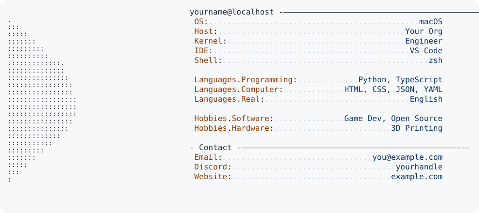

# Neofetch Profile README Template

A fork-and-customize template for a neofetch-style GitHub profile README — light/dark theme-aware, auto-generated from a single config file.

<picture>
  <source media="(prefers-color-scheme: dark)" srcset="dark_mode.svg">
  
</picture>

---

## Use this template

> **You're 5 steps away from a live profile README.**

### 1 — Fork

Click **Use this template → Create a new repository** at the top of this page.  
Name the new repo `YOUR_USERNAME` (must match your GitHub username exactly for it to appear on your profile).

### 2 — Edit `config.yml`

Clone your new repo and open `config.yml`. Fill in your info — every field has a comment explaining it. The file looks like this:

```yaml
user: yourname
host: github

# birthday stays null here — add the date as a repo secret instead (see below)
birthday: null

sections:
  - title: ""
    items:
      - "OS: macOS"
      - "IDE: VS Code"
      - "Shell: zsh"

  - title: "Contact"
    items:
      - "Email: you@example.com"
      - "Discord: yourhandle"
```

### 3 — (Optional) Add a portrait

Drop `portrait.png` or `portrait.jpg` in the repo root. The build converts it to ASCII automatically. Tips for best results:

- High-contrast photo (bright subject, simple background)
- Square crop
- At least 200×200 px

No portrait? The built-in ASCII art in `ascii-art.txt` is used as a fallback.

### 4 — Run the build

```bash
python3 -m pip install -r requirements.txt
python3 build.py
```

Open `light_mode.svg` and `dark_mode.svg` to preview your result.

### 5 — Push to GitHub

```bash
git add .
git commit -m "feat: my neofetch profile"
git push
```

Then add this to your profile repo's `README.md`:

```html
<picture>
  <source media="(prefers-color-scheme: dark)" srcset="dark_mode.svg">
  
</picture>
```

GitHub automatically shows this on your profile page. Done.

---

## Uptime counter (optional)

The **Uptime** line shows how long you've been alive — "X years, Y months" — and updates daily via the included GitHub Action.

To enable it, add your birthday as a **repo secret** (never in the config file — keep it out of your public repo):

1. Go to your repo → **Settings → Secrets and variables → Actions**
2. Click **New repository secret**
   - **Name:** `BIRTHDAY`
   - **Value:** `2000-01-15`  *(your actual date, YYYY-MM-DD)*
3. Leave `birthday: null` in `config.yml` (or omit it entirely)

The Action reads the secret automatically on every push and daily at 00:15 UTC. Days are intentionally omitted from the output to avoid narrowing down your exact birth date.

---

## What the Action does

Every push to `main` (when relevant files change) and every day at 00:15 UTC, the workflow:

1. Installs dependencies
2. Runs `python build.py` (reads `BIRTHDAY` secret if set)
3. Commits updated SVGs back to the repo (`[skip ci]` so it doesn't loop)

No setup required — it works as soon as you push your first commit.

---

## Tests

```bash
python3 -m pip install pytest
python3 -m pytest test_build.py -v
```

Tests cover config loading, ASCII conversion, age formatting, HTML escaping, SVG validity, theme rendering, and the birthday secret.

---

## What you edit vs. what's generated

| File | Edit it? | What it is |
|---|---|---|
| `config.yml` | ✅ Yes | Every neofetch field |
| `portrait.png` / `.jpg` | ✅ Optional | Your photo — auto-converts to ASCII |
| `ascii-art.txt` | ✅ Optional | Fallback ASCII art (used when no portrait) |
| `light_mode.svg` | ❌ Generated | Output — commit but don't hand-edit |
| `dark_mode.svg` | ❌ Generated | Output — commit but don't hand-edit |
| `build.py` | ❌ Leave it | The renderer |

---

Inspired by [Andrew6rant/Andrew6rant](https://github.com/Andrew6rant/Andrew6rant).
